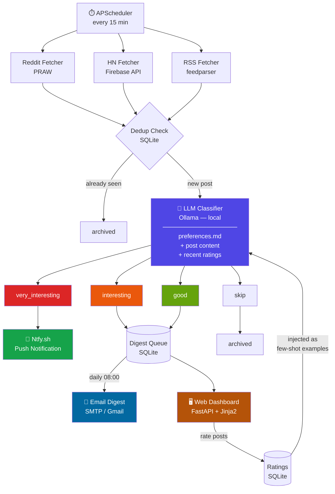

# Relay

A personal social media monitoring agent that eliminates doomscrolling. Polls Reddit, Hacker News, and RSS feeds every 15 minutes, classifies posts via a local LLM (Ollama), and routes content by priority.

## How It Works

Every 15 minutes, Relay fetches posts from your configured sources, runs them through a local LLM with your personal interest profile, and routes them:

| Bucket | What it means | Delivery |
|---|---|---|
| **Very Interesting** | Time-sensitive, actionable — options ideas, breaking AI/cloud news | Instant push notification (Ntfy.sh) |
| **Interesting** | Worth reading, not urgent | Daily email digest + web dashboard |
| **Good** | Informational, low priority | Daily email digest + web dashboard |
| **Skip** | Noise | Archived |

Over time, the system learns your taste via a feedback loop — you rate posts on the web dashboard, and those ratings are stored and used as RAG context for future classifications.

## Architecture

## Stack

- **LLM**: Ollama (local) — `llama3.1:8b` now, `llama3.3:70b` on 48GB+ hardware
- **Sources**: Reddit (PRAW), Hacker News (Firebase API), RSS (feedparser)
- **Storage**: SQLite + SQLAlchemy
- **Recommendation**: Feedback loop — user ratings injected as few-shot examples into future prompts
- **Push**: Ntfy.sh
- **Email**: SMTP (Gmail)
- **Dashboard**: FastAPI + Jinja2
- **Scheduler**: APScheduler (15-min poll loop)

## Build Phases

- **Phase 1 (MVP)**: Reddit → LLM classifier → Ntfy.sh push notification
- **Phase 2**: HN + RSS fetchers, email digest, web dashboard, feedback UI
- **Phase 3**: ChromaDB RAG — system learns your preferences over time
- **Phase 4**: Per-source prompt tuning, YouTube fetcher

## Setup

> Coming soon — scaffold in progress (MLT-111)

## Requirements

- Python 3.11+
- [Ollama](https://ollama.ai) running locally
- Reddit API credentials (free)
- Ntfy.sh account (free)
- Gmail app password for digest emails
